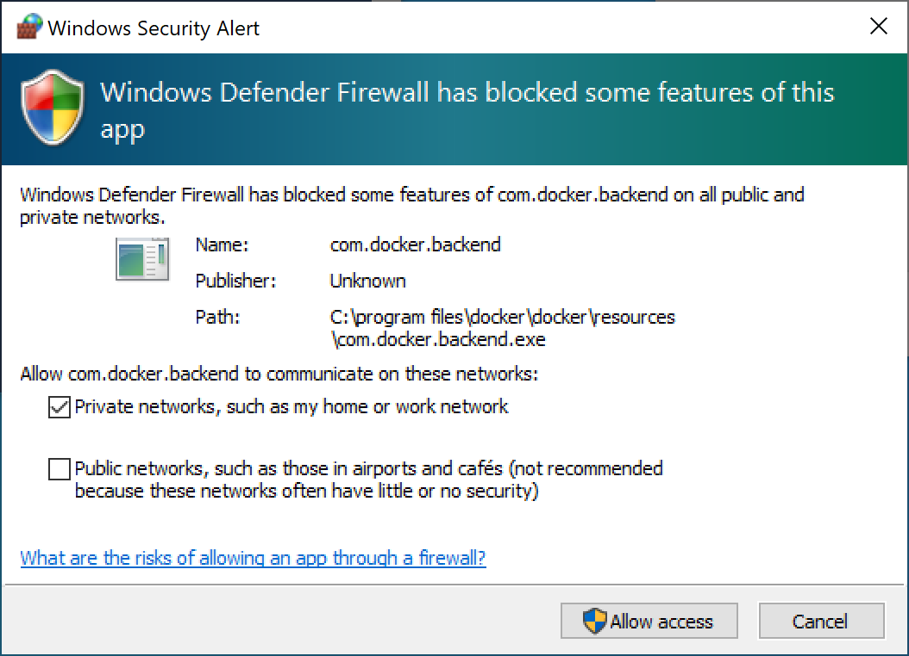

# BV Coding Challenge Sample App


## :wave: Welcome to the BV coding challenge!

You will find everything you need here for the challenge including:

* Prerequisites
* Getting Started
* The Challenge
* The Requirements
* Useful Resources

## :white_check_mark: Prerequisites

### Windows

**Git**

1. Install [Git](https://git-scm.com/download/win)
2. Open Git Bash or PowerShell to confirm successful install `git --version`


**Docker Desktop**

1. [Docker Desktop](https://www.docker.com/get-started) (requires restart)
2. Docker will now prompt you to install [wsl2-kernel](https://docs.microsoft.com/en-gb/windows/wsl/wsl2-kernel)

### Mac

**Git**

1. Open Terminal, enter `xcode-select --install` and follow onscreen instructions
2. Confirm successful install `git --version`

**Docker Desktop**

1. [Docker Desktop](https://www.docker.com/get-started)

#### Database GUI _(Optional)_

- [Sequel Pro](https://www.sequelpro.com) (Mac)
- [MySQL Workbench](https://dev.mysql.com/downloads/workbench/) (Mac & Windows)

**Connection Details**

- Host: 127.0.0.1
- Port: 3357
- User: root
- Password: password
- Database: uu_code_challenge

## :metal: Getting Started

#### Clone the project repo

```bash
git clone https://github.com/bazaarvoice/bvcodingchallenge-sampleapp-test
```

#### Browse to project folder

```bash
cd bvcodingchallenge-sampleapp-test
```

#### Start the application

```bash
docker-compose up
```

**Note:**

- Docker will download the required images and start the application. The database will be created and populated at this stage.
- **Windows users** may get the following Security Alert. Tick the first option and allow access.



#### Open the application

In your browser visit [http://localhost:5000](http://localhost:5000)

**Note:**

You may need to refresh the page as the database connects.

## :trophy: The Challenge

Build a key statistics dashboard to help the drinks retailer understand product sentiment based on customer ratings and reviews data.

## :thinking: The Problem

As a drinks retailer, I want to be able to view key stats on how our products are performing so that I can make informed business decisions. However, right now, we can only view raw csv data which we use to create our own reports in a third party analytics tool. This takes a lot of time for our teams and they have to share the reports with one another, instead of having one centralized dashboard that everyone can view.

## :bulb: The Solution

This repo includes a starter template Flask application which is linked to a database with roughly 2,500 beer ratings and reviews. You will be asked to query the database for key product statistics and send these through to the front end of the application where you can use HTML, CSS and JS to present the statistics to the end user.
 
#### Who is the user?
 
The users are marketing and sales teams, analysts and product managers who need to be able to quickly gather key stats on their products. These stats are used to make critical business decisions, for example, identifying products with low product ratings that need improvement or identifying trends in products that customers rate highly.

## :blue_book: Requirements

### Level 1 Requirements/User Stories

* As a user, I want to be able to view my average overall review rating for all beers, so that I can understand overall customer sentiment
* As a user, I want to be able to see the top 5 highest rated beers by taste, so that our sales teams can use that data for sales forecasting
* As a user, I want to be able to view the 5 lowest rated beers by overall average review rating alongside average taste rating so that I can see the influence taste has on overall review rating
 
**Optional:** Participants are encouraged to come up with additional analysis they can produce using the dataset, so long as they have a valid theory on why that analysis might be of value to a drinks retailer. Please provide a short paragraph summary to explain any additional analysis.
 
### Level 2 Requirements/User Stories

* As a user I want to see a visual comparison of 1 star reviews VS beer abv (%), so that I can see if there is a correlation between low review ratings and beer abv (%)
* As a user I want to view a chart comparing Caldera Brewery Company with Amstel Brouwerij B. V. by average aroma rating, average appearance rating, and average taste rating
* As a user, I want to see a chart of the top 5 beer styles according to the number of 4 star + overall reviews they have received, so that I can see the correlation between beer style and high review ratings

**Optional:** Participants are encouraged to come up with additional ways to visualise their data analysis, so long as they have a valid theory on why that would be of might be of value to a drinks retailer. Please provide a short paragraph summary to explain any additional analysis.

## :crystal_ball: Useful Resources

- [Python 3.9 - Docs](https://docs.python.org/3.9/)
- [Flask](https://flask.palletsprojects.com/en/1.1.x)
- [Jinja2](https://jinja.palletsprojects.com/en/2.11.x)
- [Bootstrap](https://getbootstrap.com/docs/4.5/getting-started/introduction)
- [Chart.js](https://www.chartjs.org)
